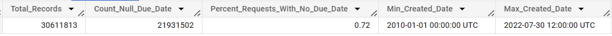
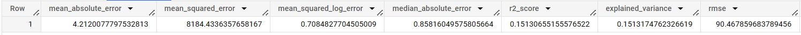
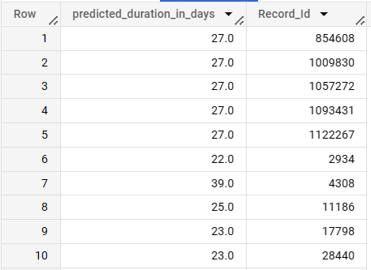

# gcp-bigquery-sql

## Data

NYC Service Requests Logs
Location: bigquery-public-data.new_york.311_service_requests

Out of the 30,611,813 records in the dataset there 72% that have no due date. Maybe we can help provide a due date when a new request in created 
by building a predictive model for request duration.

```sql
SELECT 
    COUNT(*) AS Total_Records
  , SUM(CASE WHEN due_date IS NULL THEN 1 ELSE 0 END) AS Count_Null_Due_Date
  , ROUND(SAFE_DIVIDE(SUM(CASE WHEN due_date IS NULL THEN 1 ELSE 0 END),COUNT(*)),2) AS Percent_Requests_With_No_Due_Date
  , MIN(Created_Date) AS Min_Created_Date
  , MAX(Created_Date) AS Max_Created_Date
FROM `bigquery-public-data.new_york.311_service_requests`; 
```



We can create a table with our data needed to build our model. 
Added steps for feature generation in case these additional features add predictive power.

```sql
CREATE OR REPLACE TABLE `test-project-384900.311_reqeusts_modeling.modeling_data` AS 

WITH  
  
records_by_day AS (
  SELECT 
      DATE_TRUNC(created_date,DAY) AS created_date_day
    , EXTRACT(YEAR FROM created_date) AS created_year
    , EXTRACT(MONTH FROM created_date) AS created_month
    , COUNT(DISTINCT unique_key) AS records
  FROM `bigquery-public-data.new_york.311_service_requests`
  WHERE status = 'Closed'
  AND created_date IS NOT NULL
  GROUP BY 1,2,3
),

with_windows AS (
  SELECT 
      records_by_day.*
    , SUM(records) OVER (ORDER BY created_date_day ROWS BETWEEN 1 PRECEDING AND 1 PRECEDING) AS records_previous_1_day
    , SUM(records) OVER (ORDER BY created_date_day ROWS BETWEEN 2 PRECEDING AND 2 PRECEDING) AS records_previous_2_day
    , SUM(records) OVER (ORDER BY created_date_day ROWS BETWEEN 3 PRECEDING AND 3 PRECEDING) AS records_previous_3_day
    , SUM(records) OVER (ORDER BY created_date_day ROWS BETWEEN 1 PRECEDING AND CURRENT ROW) AS records_cumulative_1_day
    , SUM(records) OVER (ORDER BY created_date_day ROWS BETWEEN 3 PRECEDING AND CURRENT ROW) AS records_cumulative_3_day
    , SUM(records) OVER (ORDER BY created_date_day ROWS BETWEEN 7 PRECEDING AND CURRENT ROW) AS records_cumulative_7_day
    , ROW_NUMBER() OVER (ORDER BY created_date_day) AS row_number
  FROM records_by_day
  ORDER BY 1
),

final_windows AS (
  SELECT * EXCEPT (row_number) FROM with_windows WHERE row_number >=7
)

SELECT  
    COALESCE(DATE_DIFF(closed_date,created_date,DAY),0) AS duration_in_days
  , agency
  , complaint_type 
  , CASE WHEN lower(location_type) LIKE '%family%' THEN 'Family'
      WHEN lower(location_type) LIKE '%other%' THEN 'Other'
      WHEN lower(location_type) LIKE '%residential%' THEN 'Residential'
      WHEN lower(location_type) LIKE '%vacant%' THEN 'Vacant'
      WHEN lower(location_type) LIKE '%restaurant%' THEN 'Restaurant'
      WHEN lower(location_type) LIKE '%public%' THEN 'Public'
      WHEN location_type IS NULL THEN 'Other'
    ELSE location_type END AS location_type 
  , COALESCE(facility_type,'Other') AS facility_type
  , final_windows.* EXCEPT(created_date_day)
FROM `bigquery-public-data.new_york.311_service_requests` requests
INNER JOIN final_windows 
  ON DATE_TRUNC(requests.created_date,DAY) = final_windows.created_date_day
WHERE requests.status = 'Closed'
AND requests.created_date IS NOT NULL
AND requests.closed_date IS NOT NULL
;
```

Create our model:

```sql
CREATE OR REPLACE MODEL `test-project-384900.311_reqeusts_modeling.model_request_duration`
       OPTIONS(model_type='AUTOML_REGRESSOR',
               input_label_cols=['duration_in_days'],
               budget_hours=1.0)
AS SELECT *
FROM `test-project-384900.311_reqeusts_modeling.modeling_data`
TABLESAMPLE SYSTEM (75 PERCENT)
;
```

Evaluation of the model:

```sql
SELECT * FROM ML.EVALUATE(MODEL `test-project-384900.311_reqeusts_modeling.model_request_duration`,
(
  SELECT *
  FROM `test-project-384900.311_reqeusts_modeling.modeling_data`
  TABLESAMPLE SYSTEM (5 PERCENT)
))
```



Results:
- TBD
- TBD
- TBD

Using the model for predictions, in case we get to the point where we are confident in the model performance and we want to use this model in production:

```sql 
SELECT * FROM ML.PREDICT(MODEL `test-project-384900.311_reqeusts_modeling.model_request_duration`,
(
  SELECT * EXCEPT(duration_in_days)
  FROM `test-project-384900.311_reqeusts_modeling.modeling_data`
  TABLESAMPLE SYSTEM (5 PERCENT)
));
```

